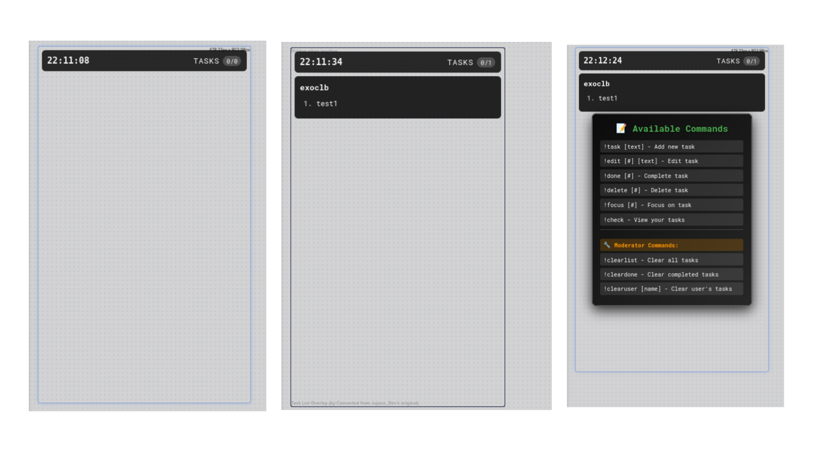
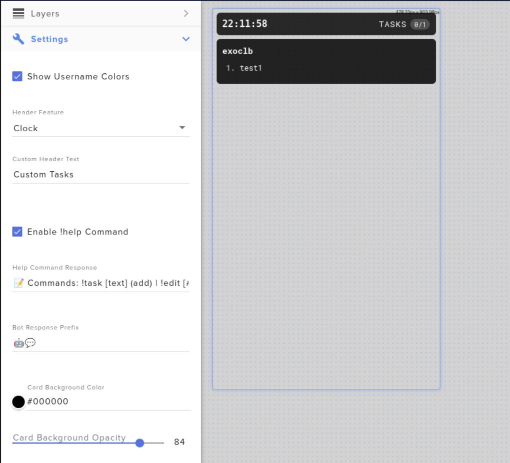

# 🎮 Twitch Task List Overlay

An interactive task management overlay for Twitch streamers that allows viewers to create, edit, and manage tasks through chat commands. Perfect for productivity streams, coding sessions, study streams, or any content where task tracking enhances viewer engagement.

  

## ✨ Features

### 🎯 **Core Functionality**
- **Interactive Chat Commands** - Viewers manage tasks through simple chat commands
- **Real-time Updates** - Tasks appear instantly on the overlay
- **User-specific Task Lists** - Each viewer maintains their own personal task list
- **Persistent Storage** - Tasks are saved and persist across stream sessions
- **Visual Help System** - On-screen command help with `!help`

### 💬 **Chat Commands**

#### 👥 **For Everyone:**
- `!task [text]` or `!add [text]` - Add new task
- `!edit [#] [new text]` - Edit task by number
- `!done [#]` - Mark task as completed
- `!delete [#]` - Delete task by number
- `!focus [#]` - Highlight/focus on a task
- `!check` - View your task summary
- `!help` - Show command help on screen

#### 🔧 **For Moderators/Broadcasters:**
- `!clearlist` - Clear all tasks from everyone
- `!cleardone` - Remove all completed tasks
- `!clearuser [username]` - Clear specific user's tasks

### 🎨 **Customization**
- **Multiple Header Options** - Clock, custom text, commands, or tasks-only
- **Color Customization** - Full control over colors and opacity
- **Responsive Design** - Works perfectly in OBS and streaming software
- **Multi-language Support** - Available in 7 languages

## 🚀 Quick Start

1. **Go to StreamElements**
   - Visit [streamelements.com](https://streamelements.com)
   - Navigate to `Overlays` → Your overlay → `Add Widget` → `Custom`

2. **Copy Widget Code**
   - Download this repository
   - Copy the widget.html, widget.js, widget.css, and fields.json
   - Paste into StreamElements custom widget editor

3. **Configure & Deploy**
   - Customize settings in the left panel
   - Click "Done" and position in your overlay
   - Copy url overlay

3. **Add to OBS**
   - Add Browser Source pointing to `url overlay`
   - Set dimensions to 660x1600px

## 🎛️ Configuration Options

### 📋 **Task Settings**
- **Max Tasks Per User** (1-20) - Limit tasks per viewer
- **Show Username Colors** - Display Twitch chat colors

### 📺 **Header Options**
- **Clock** - Real-time clock display
- **Custom Text** - Your personalized message
- **Commands** - Shows "!help for commands"
- **Tasks Only** - Just the task counter

### 🎨 **Visual Styling**
- Card background color & opacity
- Task text colors
- Focus highlight colors
- Header styling options

## 🌍 Multi-language Support

Available in 7 languages with localized commands:
- 🇺🇸 **English** (EN)
- 🇪🇸 **Spanish** (ES) 
- 🇫🇷 **French** (FR)
- 🇯🇵 **Japanese** (JP)
- 🇺🇦 **Ukrainian** (UA)
- 🇩🇪 **German** (DE)
- 🇧🇷 **Portuguese Brazilian** (PT_BR)

## 📸 Screenshots

  
   
  <em>Easy customization through StreamElements interface</em>

## 🛠️ Development

### **Contributing**
1. Fork the repository
2. Create a feature branch: `git checkout -b feature-name`
3. Make your changes
4. Test thoroughly
5. Submit a pull request

## 🆘 Troubleshooting

### **Common Issues**

**Tasks not appearing?**
- Check browser console (F12) for errors
- Verify widget is properly positioned in overlay
- Ensure chat commands are typed correctly

**StreamElements widget not working?**
- Verify all code sections are properly filled
- Check for JavaScript errors in console
- Try refreshing the overlay in OBS

## 📄 License

This project is licensed under the MIT License - see the [LICENSE](LICENSE) file for details.

## 🙏 Credits

**Original Creator:** [@Jujoco_Dev](https://twitch.tv/Jujoco_Dev)  
**StreamElements Integration:** Enhanced with visual help system and SE API integration  
**Community:** Thanks to all contributors and testers  

## ⭐ Support the Project

If this overlay helps your stream, consider:
- ⭐ Starring this repository
- 🐛 Reporting bugs or suggesting features
- 💬 Sharing with other streamers
- 🔄 Contributing improvements

---

  <strong>Happy Streaming! 🎉</strong> 
  Made with ❤️ for the Twitch community

